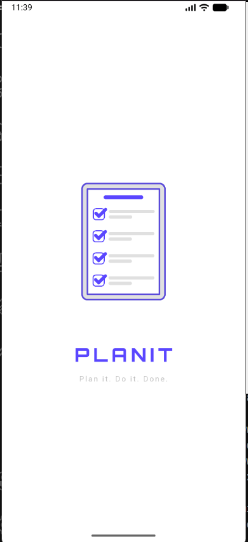
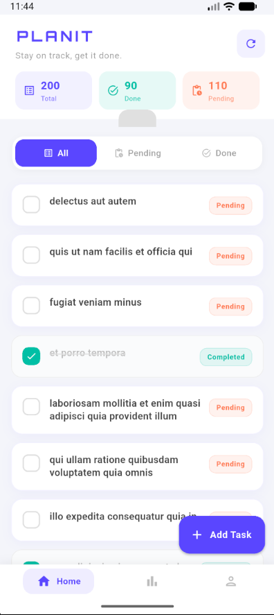
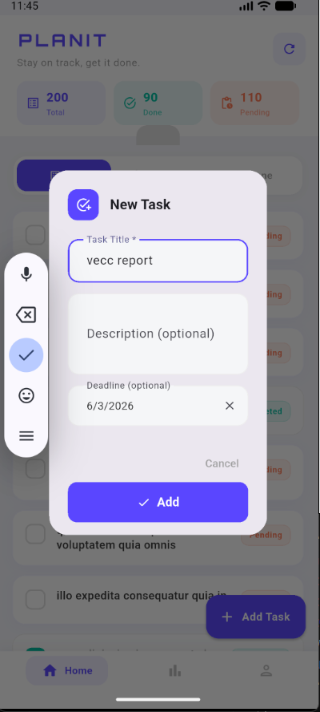
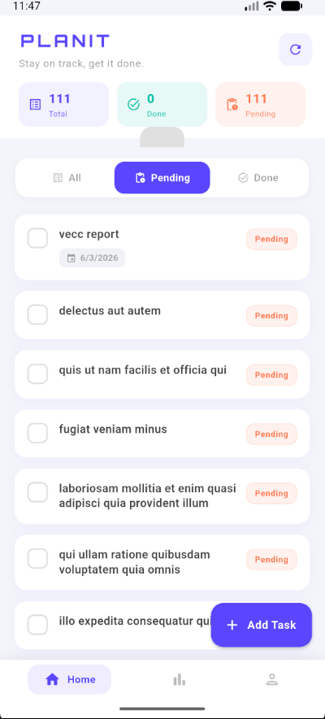
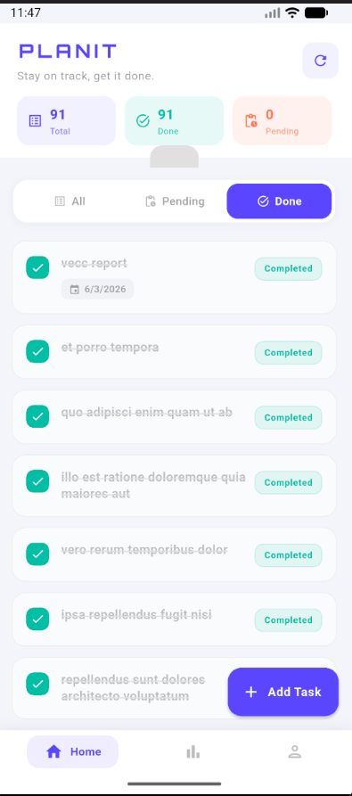

# PLANIT — Task Manager App

A clean, modern **Task Manager** application built with **Flutter**. PLANIT lets users manage their daily tasks with an intuitive clipboard-style UI, real-time filters, and a cool indigo-themed design.

---

## Project Overview

PLANIT is a mobile task management app that fetches tasks from a REST API and allows users to add, toggle, and filter tasks. The app features:

- **Splash Screen** — Animated Lottie intro with the PLANIT branding
- **Login Screen** — Credential-based authentication (username & password)
- **Home Screen** — Clipboard-style task list with summary stats and filter tabs (All / Pending / Done)
- **Stats Screen** — Circular progress ring and stat cards showing completion overview
- **Profile Screen** — User info, app settings, and logout
- **Bottom Navigation Bar** — Smooth tab switching between Home, Stats, and Profile
- **Add Task Dialog** — Create tasks with title, optional description, and optional deadline
- **Task Toggle** — Tap any task card to mark it complete/incomplete

---

## Tech Stack Used

| Technology | Purpose |
|---|---|
| **Flutter** (SDK ^3.10.0) | Cross-platform UI framework |
| **Dart** | Programming language |
| **Material Design 3** | UI component system (`useMaterial3: true`) |
| **Provider** (^6.1.5+1) | State management |
| **http** (^1.6.0) | REST API calls |
| **Lottie** (^3.3.2) | Splash screen animation |
| **Google Fonts** (^8.0.2) | Orbitron font for branding |

**API:** [JSONPlaceholder /todos](https://jsonplaceholder.typicode.com/todos)

---

## State Management Approach

The app uses the **Provider** package for state management:

- **`TaskProvider`** (extends `ChangeNotifier`) — holds the single source of truth for all task data
  - `fetchTasks()` — fetches tasks from the API
  - `addTask()` — adds a new local task with optional description & deadline
  - `toggleTask()` — toggles a task's completion status
  - `setFilter()` — switches between All, Pending, and Completed views
- The provider is initialized at the root of the widget tree via `ChangeNotifierProvider` in `main.dart`
- All screens (`HomeScreen`, `StatsScreen`) consume the provider using `context.watch<TaskProvider>()` for reactive rebuilds

---

## Project Structure

```
lib/
├── main.dart                  # App entry point, Provider setup
├── models/
│   └── task_model.dart        # Task data model with copyWith
├── providers/
│   └── task_provider.dart     # State management (fetch, add, toggle, filter)
├── services/
│   └── task_service.dart      # HTTP service with API calls
├── screens/
│   ├── splash_screen.dart     # Lottie animated splash
│   ├── login_screen.dart      # Credential-based login
│   ├── main_screen.dart       # Bottom navigation shell
│   ├── home_screen.dart       # Task list with clipboard UI
│   ├── stats_screen.dart      # Progress overview
│   └── profile_screen.dart    # User profile & logout
├── widgets/
│   └── task_card.dart         # Individual task card widget
└── utils/
    └── app_theme.dart         # Centralized theme & color palette
```

---

## Steps to Run the Project

### Prerequisites
- Flutter SDK (^3.10.0) installed
- Android Studio / VS Code with Flutter extension
- An Android emulator or physical device

### Run Commands

```bash
# 1. Clone the repository
git clone <repository-url>
cd task_manager

# 2. Install dependencies
flutter pub get

# 3. Run the app
flutter run

# 4. (Optional) Build APK
flutter build apk --debug
```

### Login Credentials

| Field | Value |
|---|---|
| Username | `planit_user` |
| Password | `planit_pass` |

---

## App Screenshots

| Splash | Login | Home |
|---|---|---|
|  |  |  |

| Add Task | Pending Filter | Task Done |
|---|---|---|
|  |  |  |

| Analytics |
|---|
|  |

---

## Device / Emulator Used for Testing

- **Emulator:** Android Emulator (Pixel device, API 34)
- **OS:** Windows 11

---

## Features Summary

- Animated Lottie splash screen
- Secure login with credential validation
- REST API integration with error handling
- Add tasks with title, description & deadline
- Toggle task completion with animated checkbox
- Filter tasks: All / Pending / Done
- Stats dashboard with progress ring
- Profile page with logout
- Bottom navigation bar (Home, Stats, Profile)
- Clean indigo-themed UI (colors matched to splash animation)
- Pull-to-refresh on task list
